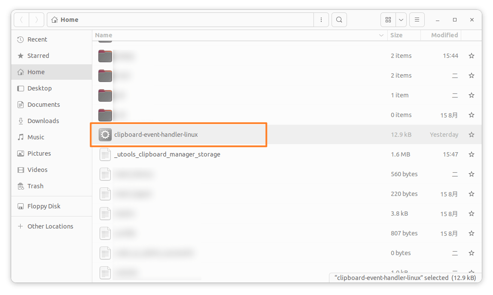
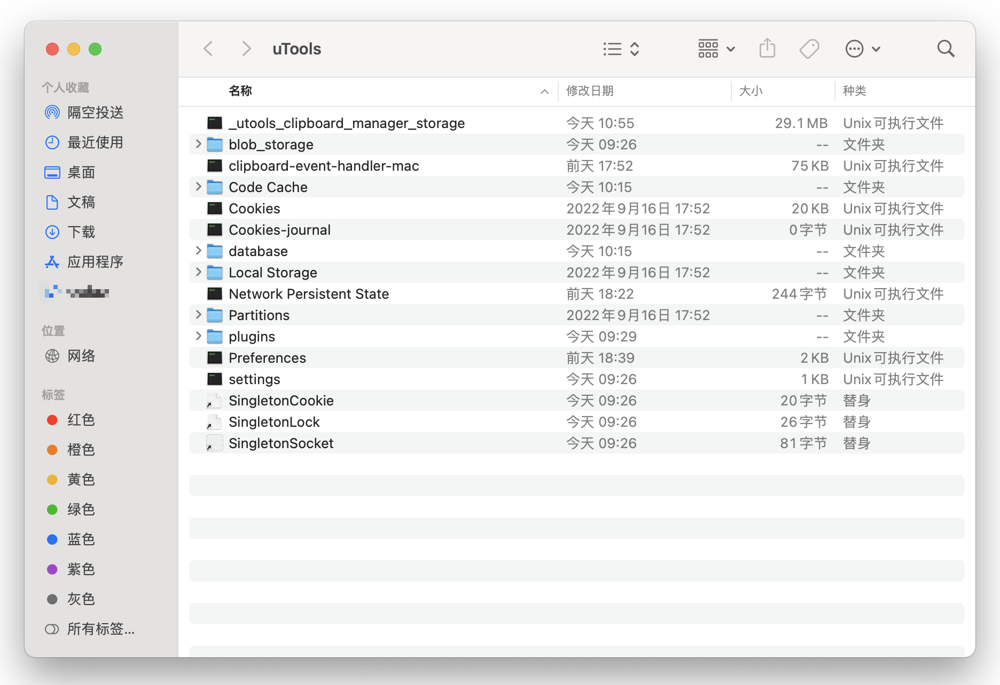
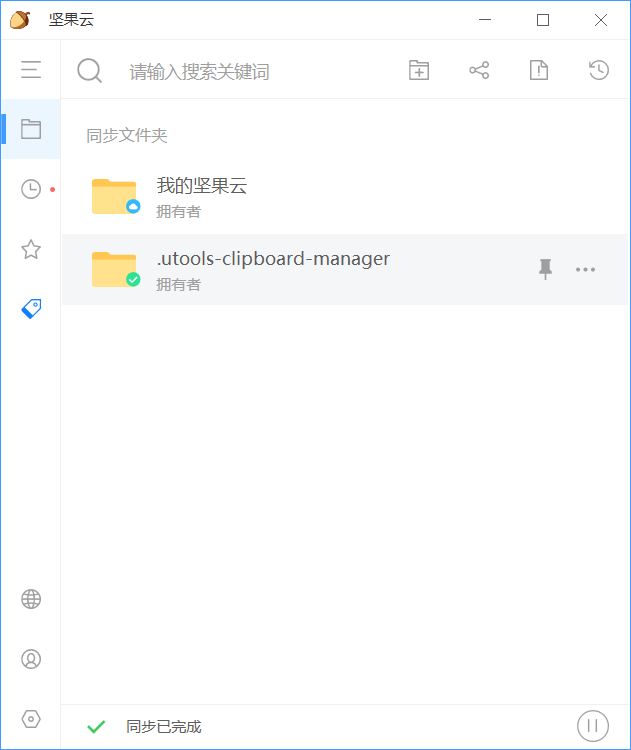
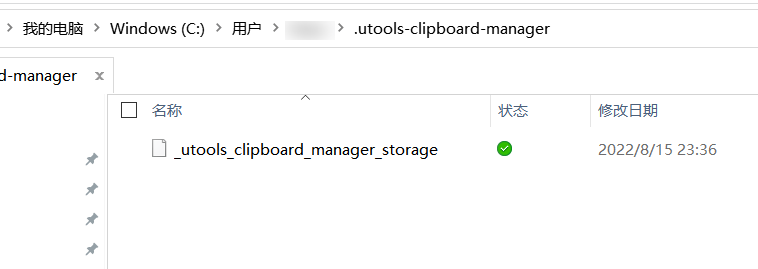

# 使用指南

## 如何手动安装`clipboard-event-handler`

新版 `超级剪贴板` 对剪贴板内容更新事件的监听，依赖于可执行文件：

- Windows系统: `clipboard-event-handler-win32.exe`
- Linux系统: `clipboard-event-handler-linux`
- MacOS系统: `clipboard-event-handler-mac`

插件每次启动时，将自动检查剪贴板数据文件所在目录下是否存在剪贴板监听程序，如存在，则使用性能更优秀的新的监听策略，如不存在，则仍然使用旧的策略。

----

### 1. 下载监听程序

请[点击此处（百度网盘）](https://pan.baidu.com/s/14GJIXWDU2F4jsqDDq73aFg?pwd=Ziuc)或访问[node-clipboard-event](https://github.com/sudhakar3697/node-clipboard-event/tree/master/platform)手动下载**对应系统**的文件，并将其移动到**剪贴板数据文件所在目录**下

插件使用的二进制文件拷贝自[node-clipboard-event](https://github.com/sudhakar3697/node-clipboard-event)，请避免从其它不可信的来源下载文件，并在下载文件后比较哈希，有能力的也可以从仓库源代码自行编译

### 2. 找到剪贴板数据文件所在目录

进入插件设置页（右上角💡按钮），打开插件数据文件所在路径：


### 3. 将监听程序拷贝到目录中

#### Windows:


#### Linux:



#### Mac:



### 4. 【重要】注意事项

#### MacOS需要特殊配置

`MacOS`拷贝完成后需要对插件进行签名&授权才能正常使用具体步骤如下

**1. 签名**

打开终端输入以下命令

```sh
sudo codesign --force --deep --sign - 
```


然后将此目录中的`clipboard-event-handler-mac`文件拖入终端执行命令


**2. 授权**

*左上角🍎* -> *系统偏好设置* -> *安全性与隐私* -> *通用* -> *点击允许*


#### 监听程序不生效如何排查？

请务必完整按照教程完成安装，如果程序仍未生效，请按照如下方式排查：

- 监听程序拷贝完成后，需要重启插件方可生效
- 设置页`剪贴板监听程序状态`选项是否为`已安装`
- 系统进程管理器中是否存在`clipboard-event-handler-xxxxx`的进程

使用中遇到任何问题，请尝试通过论坛或加入QQ群反馈


## 如何实现多端同步

### WebDav同步 <Badge type="tip" text="^2.0.0" />

::: tip
自`v2.0.0`起，可以通过开通插件会员启用**WebDav同步功能**
:::

👉👉👉[插件会员/WebDav同步功能](../vip/index.md#webdav同步功能)👈👈👈

### 坚果云同步文件夹 <Badge type="warning" text="仅旧版本" />

::: warning
以下方法仅适用于`v2.0.0`之前的版本

数据库文件默认是直接存放在用户文件夹根目录下的，如果需要使用同步功能，请使用插件内提供的`数据库路径自定义`功能，将数据库路径改为其他路径，而后才能通过下文中讲述的`同步文件夹`实现云同步。
:::

到[坚果云官网](https://www.jianguoyun.com/#/)安装好软件后，找到`_utools_clipboard_manager_storage`文件所在的目录

右键目录，`坚果云`/`同步该文件夹`，将此文件夹加入到坚果云的同步服务中



这样，每次剪贴板内容更新都将自动触发坚果云的同步服务，将剪贴板数据同步到云端

其他安装了坚果云的设备也将自动同步更新



### OneDrive

> 有待测试

## 快捷键一览

- `Shift`进入多选模式 按下`空格`连续向下选择 支持**跨标签**合并复制/粘贴
- `鼠标左键`复制并粘贴 `鼠标右键`仅复制
- `↑` `↓`选中历史记录 按下`↵`直接粘贴
- `←` `→`切换分类 `Tab`键连续切换分类
- `Ctrl/Alt+数字键` 快速粘贴
- `输入任意字母或数字`自动聚焦搜索框 支持使用`空格`同时检索多个关键词

## 如何迁移数据

剪贴板数据默认存放在

- `Windows` `Linux`用户：`{home}\_utools_clipboard_manager_storage`
- `Mac`用户：`{userData}\_utools_clipboard_manager_storage`

也可以在设置页中点击按钮打开数据库路径。要手动迁移数据，只需要在新设备上运行一次插件，而后将原设备上的数据文件拷贝并替换新设备中的数据文件即可

## 如何创造自己的功能按钮

从`v1.4.0`起，插件为用户提供了自定义功能按钮的能力

这让`超级剪贴板`真正变得“超级”起来，用户可以通过编写`json`实现**携带数据跳转到任何其他插件**，这项功能给`超级剪贴板`带来了无限可能。

插件中，默认内置了若干使用样例：

- 讯飞OCR识别
- 百度搜索
- 百度识图
- 统计文本字数
- 颜色管理
- 识别图片中二维码
- 上传到图床
- 翻译

下面我将从这些样例出发对这项功能做简单介绍：

这项功能的原理是`utools.redirect()`，在不分离插件的情况下，在不同插件之间的跳转体验是连贯的。

以`百度搜索`为例，是通过`网页快开`提供的关键词实现的，我们可以编写以下json：

```json
{
  "id": "custom.1663490859",
  "title": "百度搜索",
  "icon": "🔍",
  "match": ["text"],
  "command": "redirect:百度一下"
}
```

可以实现从剪贴板直接跳转到`网页快开`，也即打开百度并搜索当前选中的文本内容。

除了使用简单的字符串匹配不同的内容，`超级剪贴板`还支持使用正则表达式，以`上传到图床`功能为例：

```json
{
  "id": "custom.1663490864",
  "title": "上传到图床",
  "icon": "🚀",
  "match": ["image", { "type": "file", "regex": ".(?:jpg|jpeg|png)$" }],
  "command": "redirect:上传到图床"
}
```

这个功能除了可以匹配图片，还可以将符合正则的图片文件匹配上，在匹配上的历史记录上展示`上传到图床`按钮，携带数据跳转到图床插件，一键上传。

需要注意的是，因为自定义功能按钮实现的是**携带数据跳转不同插件**，所以`redirect`后的内容并不应该是普通关键字（普通关键字仅能作为插件入口，而不能携带数据），而应该是`文本`/`图片`/`文件或文件夹`：


- `id`: `String` 全局唯一 必须以`custom`开头 建议以时间戳为后缀
- `title`: `String` 鼠标悬停时展示的文本
- `icon`: `String` 展示在插件内的图标
- `match`: `<String | Object>[]` 匹配模式
- `command`: `String` 执行跳转的关键字 前缀`redirect:`是必须的

在未来的版本更新中，`超级剪贴板`将开放更多自定义功能给高级用户，帮助你更高效率的管理、使用剪贴板。
